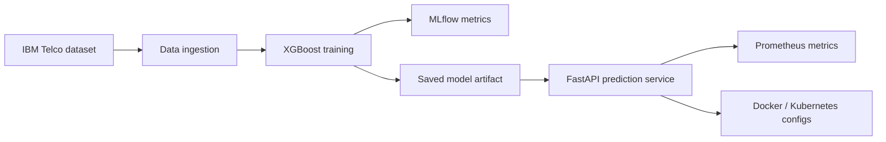

# MLOps End-to-End Pipeline: Customer Churn Prediction

[](https://www.python.org/downloads/)
[](https://fastapi.tiangolo.com/)
[](https://www.docker.com/)

An end-to-end MLOps project for customer churn prediction. I use it to practice the core
workflow around a model service: data ingestion, model training, experiment tracking,
FastAPI serving, Prometheus metrics, Docker packaging, and Kubernetes manifests.

This is a portfolio-scale implementation, not a production system with live traffic. The
useful part is the shape of the workflow and the verification around it.

## Project Overview

The model predicts customer churn using the IBM Telco Customer Churn dataset. The repo
keeps the trained artifact in `models/churn_model.joblib` so the API can be smoke-tested
without retraining first.

## Model Performance

| Metric | Score |
| ------ | ----- |
| Train Accuracy | 84.5% |
| Test Accuracy | 80.1% |
| AUC-ROC | 0.84 |
| Precision | 0.66 |
| Recall | 0.52 |
| F1-Score | 0.58 |

Metric details and the recompute command are documented in
[docs/model-metrics.md](docs/model-metrics.md).

For the engineering narrative behind the project, see the
[case study](docs/case-study.md).

## Architecture



## Features

- **Data pipeline:** ingestion and preprocessing for the churn dataset
- **Model training:** XGBoost classifier with logged parameters and metrics
- **Experiment tracking:** MLflow metrics and model artifacts
- **API serving:** FastAPI endpoints for health, readiness, prediction, metrics, and docs
- **Monitoring:** Prometheus scrape config for prediction and latency metrics
- **Packaging:** Dockerfile, Docker Compose, and Kubernetes deployment manifest
- **Testing:** pytest checks for API behavior, validation, data cleaning, and feature prep

## Quick Start

### Prerequisites

- Python 3.10+
- Docker, optional for serving and container smoke checks

### Local Development

```bash
git clone https://github.com/GoparapukethaN/mlops-end-to-end-pipeline.git
cd mlops-end-to-end-pipeline

python -m venv .venv
. .venv/bin/activate
pip install -r requirements.txt

python -m src.data.ingestion
python -m src.models.train
python -m uvicorn src.api.main:app --host 0.0.0.0 --port 8000
```

### Docker

```bash
docker build -t churn-prediction:latest -f docker/Dockerfile .
docker run -p 8000:8000 churn-prediction:latest
```

## Verification

Run the full local verification path:

```bash
make verify
```

Or run the parts separately:

```bash
make test
make lint
make format-check
make prometheus-check
```

If Docker is installed, verify the Compose/container path locally:

```bash
make compose-check
make docker-check
# or
make verify-full
```

## API Endpoints

| Endpoint | Method | Description |
| -------- | ------ | ----------- |
| `/` | GET | Service status |
| `/health` | GET | Health check |
| `/health/ready` | GET | Readiness check for model loading |
| `/predict` | POST | Churn prediction |
| `/metrics` | GET | Prometheus metrics |
| `/docs` | GET | Swagger documentation |

### Sample Prediction Request

```bash
curl -X POST "http://localhost:8000/predict" \
  -H "Content-Type: application/json" \
  -d '{
    "tenure": 12,
    "MonthlyCharges": 70.5,
    "TotalCharges": 846.0,
    "Contract": "Month-to-month",
    "PaymentMethod": "Electronic check",
    "gender": "Female",
    "SeniorCitizen": 0,
    "Partner": "Yes",
    "Dependents": "No",
    "PhoneService": "Yes",
    "MultipleLines": "No",
    "InternetService": "Fiber optic",
    "OnlineSecurity": "No",
    "OnlineBackup": "No",
    "DeviceProtection": "No",
    "TechSupport": "No",
    "StreamingTV": "Yes",
    "StreamingMovies": "Yes",
    "PaperlessBilling": "Yes"
  }'
```

### Sample Response

```json
{
  "churn_probability": 0.4744,
  "churn_prediction": 0,
  "risk_level": "Medium"
}
```

## Tech Stack

| Category | Technologies |
| -------- | ------------ |
| ML framework | XGBoost, Scikit-learn |
| Experiment tracking | MLflow |
| API framework | FastAPI, Uvicorn |
| Monitoring | Prometheus |
| Containerization | Docker |
| Orchestration | Kubernetes |
| Verification | pytest, flake8, Black, isort, compileall, optional Docker Compose config, optional Docker smoke check |
| Language | Python 3.10 |

## Project Structure

```text
mlops-end-to-end-pipeline/
├── .github/workflows/
│   └── CI-CD.yaml
├── configs/
│   └── prometheus.yml
├── data/
│   ├── raw/
│   └── processed/
├── docker/
│   └── Dockerfile
├── kubernetes/
│   └── deployment.yaml
├── scripts/
│   └── verify-local.sh
├── mlruns/
├── models/
│   └── churn_model.joblib
├── src/
│   ├── api/
│   ├── data/
│   └── models/
├── tests/
├── Makefile
├── requirements.txt
└── README.md
```

## MLflow Experiment Tracking

The training code logs:

- model parameters: `n_estimators`, `max_depth`, `learning_rate`
- metrics: accuracy, precision, recall, F1, AUC
- model artifacts

The API loads the repo-owned `models/churn_model.joblib` artifact for local demos and
tests. I treat `MODEL_PATH` as a trusted local artifact path; joblib/pickle files should
not be loaded from untrusted sources.

## Verification Status

The repository currently uses local verification as the primary proof path. The local
checks cover 15 pytest tests, strict linting, formatting, source compilation, Prometheus
config parsing, Docker Compose configuration validation, and an optional Docker image
smoke check.

Latest local verification details: [docs/verification.md](docs/verification.md).

## Author

**Kethan Goparapu**

- GitHub: [@GoparapukethaN](https://github.com/GoparapukethaN)
- LinkedIn: [Connect with me](https://www.linkedin.com/in/kethan-goparapu/)

## License

This project is licensed under the MIT License. See [LICENSE](LICENSE) for details.
